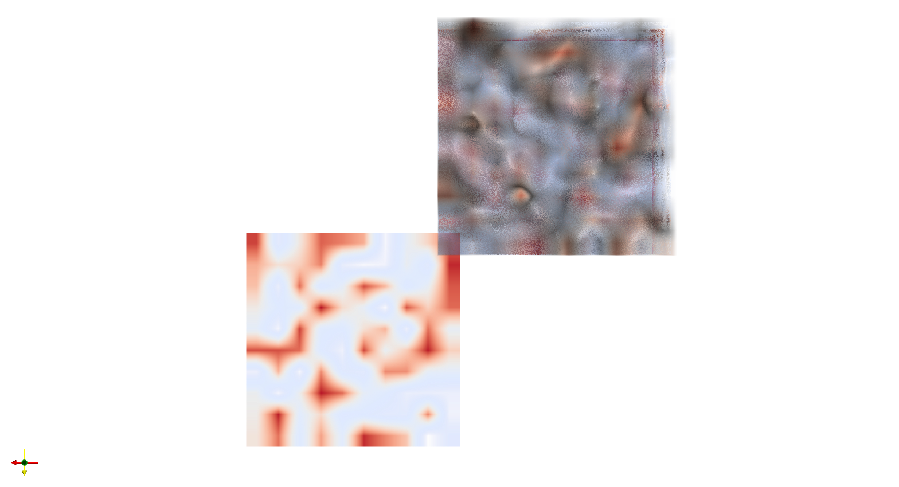

# TF2.4_IVIM-MRI_CodeCollection

This project is designed to run the `nifti_wrapper` script using a Docker container. Below are the steps to build and run the Docker image.

## Prerequisites

- Docker must be installed on your system. 

## Directory Structure

```
~/TF2.4_IVIM-MRI_CodeCollection/
│
├── Docker/
│   └── Dockerfile
│       └── dicom2nifti/
│           └── Dockerfile
│
├── WrapImage/
│   └── nifti_wrapper.py
│   └── dicom2niix_wrapper.py
│
└── requirements.txt
```

## Options

Before running the Docker container, here are the available options for the `Docker image` script:

- `input_file`: Path to the input 4D NIfTI file.
- `bvec_file`: Path to the b-vector file.
- `bval_file`: Path to the b-value file.
- `--affine`: Affine matrix for NIfTI image (optional).
- `--algorithm`: Select the algorithm to use (default is "OJ_GU_seg").
- `algorithm_args`: Additional arguments for the algorithm (optional).

## Building the Docker Image

1. Open a terminal and navigate to the project directory:

    ```sh
    cd ~/TF2.4_IVIM-MRI_CodeCollection
    ```

2. Build the Docker image using the `docker build` command:

    ```sh
    sudo docker build -t tf2.4_ivim-mri_codecollection -f Docker/Dockerfile .
    ```
    OR (If you need to convert your data from DICOM TO NIfTI images)
    ```sh
    sudo docker build -t tf2.4_ivim-mri_codecollection -f Docker/dicom2nifti/Dockerfile .
    ```

## Running the Docker Container

1. Once the image is built, you can run the Docker container using the `docker run` command. This command runs the Docker image with the specified input files:

    ```sh
    sudo docker run -it --rm --name TF2.4_IVIM-MRI_CodeCollection \
        -v ~/TF2.4_IVIM-MRI_CodeCollection:/usr/src/app \
        -v ~/TF2.4_IVIM-MRI_CodeCollection:/usr/app/output \ 
        tf2.4_ivim-mri_codecollection Downloads/brain.nii.gz Downloads/brain.bvec Downloads/brain.bval \
    ```

    Replace `brain.nii.gz`, `brain.bvec`, and `brain.bval` with the actual file names you want to use.

## Running the Docker container for reading in DICOM Images

- You can run the dicom2nifti Docker container using the `docker run` command. This command runs the Docker image with the specified input files:

    ```sh
    sudo docker run -it --rm --name TF2.4_IVIM-MRI_CodeCollection \
        -v ~/TF2.4_IVIM-MRI_CodeCollection:/usr/src/app \
        -v ~/TF2.4_IVIM-MRI_CodeCollection:/usr/app/output \
        tf2.4_ivim-mri_codecollection \
        /usr/src/app/dicom_folder
    ```

- You can run the dicom2niix_wrapper.py script either directly or from inside a Docker container (non-interactive only). Here are the available options:

### Example usage

```sh
sudo docker run -it --rm --name TF2.4_IVIM-MRI_CodeCollection \
    -v ~/TF2.4_IVIM-MRI_CodeCollection:/usr/src/app \
    -v ~/TF2.4_IVIM-MRI_CodeCollection:/usr/app/output \
    tf2.4_ivim-mri_codecollection \
    /usr/src/app/dicom_folder -o /usr/app/output
```

```sh
sudo docker run -it --rm --name TF2.4_IVIM-MRI_CodeCollection \
    -v ~/TF2.4_IVIM-MRI_CodeCollection:/usr/src/app \
    -v ~/TF2.4_IVIM-MRI_CodeCollection:/usr/app/output \
    tf2.4_ivim-mri_codecollection \
    /usr/src/app/dicom_folder -o /usr/app/output -m
```

```sh
sudo docker run -it --rm --name TF2.4_IVIM-MRI_CodeCollection \
    -v ~/TF2.4_IVIM-MRI_CodeCollection:/usr/src/app \
    -v ~/TF2.4_IVIM-MRI_CodeCollection:/usr/app/output \
    tf2.4_ivim-mri_codecollection \
    /usr/src/app/dicom_file -o /usr/app/output -s
```

#### Required parameters

input: Path to the input DICOM directory. Some scanners store images in nested subfolders, so a single session might be stored in the folders "/usr/subj22/111", "/usr/subj22/112" and "/usr/subj22/123". In this case you should simply provide the parent directly ("/usr/subj22") and dcm2niix will recursively search the sub directories and organize all your images for you.

output: Path to the output directory for the converted NIfTI files.

#### Optional Flags

#### -m, --merge-2d

Merge 2D slices into a 3D or 4D NIfTI image regardless of study time, echo, coil, orientation, etc.
Depending on your vendor, you may want to keep images segmented based on these attributes or merge/combine them.

#### -s, --single-file

Use single file mode (convert only one series per folder).

For example, if the input path "~/dir/001.dcm" will only convert the file 001.dcm.

#### -pu, --prompt-user

Run the tool in interactive mode. This launches a terminal-based wizard where you can select DICOM folders and configure conversion interactively.

[Note that NIfTI and DICOM encode space differently](https://www.nitrc.org/plugins/mwiki/index.php/dcm2nii:MainPage#Spatial_Coordinates)


##### The goal of dcm2niix is to create FSL format bvec/bval files for processing. A crucial concern is ensuring that the gradient directions are reported in the frame of reference expected by the software you use to fit your tractography. [dicom2niix should generate a ".bvec" file that reports the tensors as expected](https://www.nitrc.org/plugins/mwiki/index.php/dcm2nii:MainPage#Diffusion_Tensor_Imaging) by FSL's dtifit, where vectors are reported relative to image frame of reference (rather than relative to the scanner bore)

#### It is strongly recommend that users check validate the b-vector directions for their hardware and sequence as [described in a dedicated document](https://www.nitrc.org/docman/?group_id=880)



#### Output of NIFTI and DICOM objects generated from signal generation test

- NIfTI follows the Talairach/MNI coordinate system where the X value increases as we move toward the participant's right, the Y increases as we move anteriorly. In contrast, for bipeds DICOM specifies the the X increases as we more toward the participant's left, while the Y increases as we move posteriorly. Both agree that the Z coordinate increases as we move superiorly. 
---
