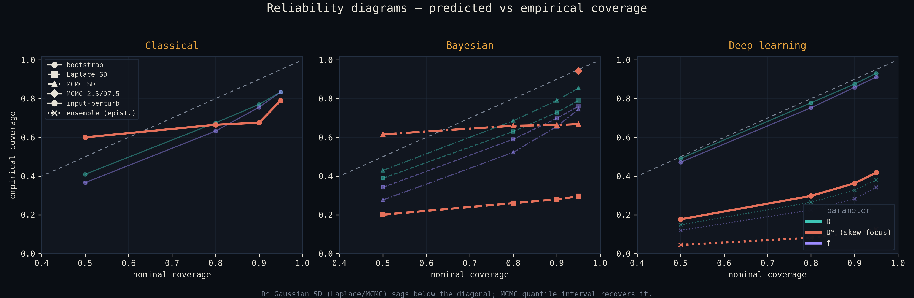
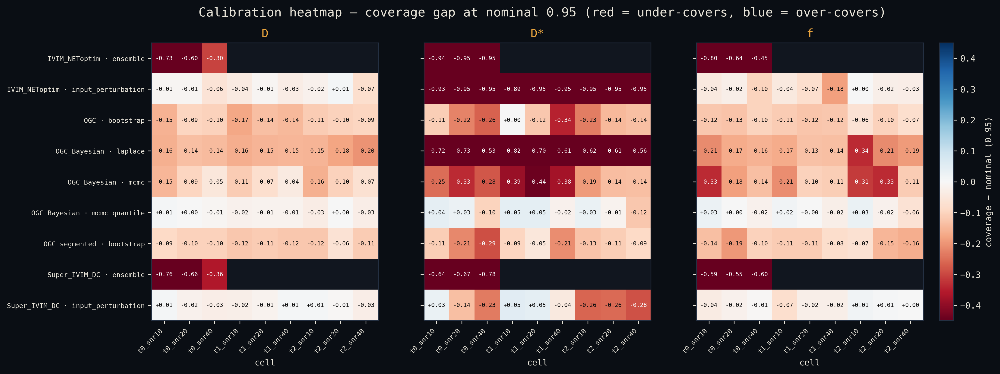

# Do IVIM fitting methods report *honest* uncertainty?

[](https://doi.org/10.5281/zenodo.20649669)

An uncertainty-quantification & **calibration** study for intravoxel incoherent
motion (IVIM) diffusion-MRI fitting. The question is not "how accurate is the
point estimate?" but the harder one a clinician actually relies on: **when a
method reports an error bar, can you believe it?** A method can be precise and
still badly *overconfident* — tight intervals that miss the truth far more often
than their nominal level promises.

This is my analysis layer (the [`uq/`](uq/) package) built on top of the OSIPI
TF2.4 IVIM code collection. The upstream fitting engines under `src/` are
**unmodified**; everything in `uq/` is original work that wraps them, constructs
per-voxel uncertainty for methods that don't natively report it, and scores that
uncertainty with one calibration ruler. See
[`README_upstream.md`](README_upstream.md) for the upstream project.

## What's in this fork — my contribution

Three uncertainty paradigms, each reusing the *method's own* machinery so the
uncertainty is the method's, not a bolt-on, all reduced to a common
`(estimate, sigma)` (plus interval) interface:

| Paradigm | What it does | Module |
|---|---|---|
| **Bayesian posterior** (Laplace + MCMC) | Reuses the OGC AmsterdamUMC *Bayesian* method's own `neg_log_posterior`. **Laplace**: inverse-Hessian of −log-posterior at the MAP → Gaussian SD. **MCMC**: `emcee` on the same posterior → posterior SD *and* the 2.5/97.5 quantile credible interval. | [`uq/bayesian.py`](uq/bayesian.py) |
| **Residual bootstrap** (classical) | Resamples fit residuals, refits *K* times, takes the SD of the replicates — the classical method's own per-voxel uncertainty. | [`uq/bootstrap.py`](uq/bootstrap.py) |
| **Deep ensemble + Rician parametric bootstrap** (deep learning) | **Ensemble**: *M* independent retrains → SD across members = epistemic/run-to-run uncertainty. **Input perturbation**: re-noise each voxel's curve with Rician noise and refit → predictive (aleatoric) uncertainty. | [`uq/dl_uncertainty.py`](uq/dl_uncertainty.py) |

…all judged by **one calibration ruler**, [`uq/calib.py`](uq/calib.py):

- **coverage(L)** — fraction of realizations whose nominal-*L* interval actually
  contains the known truth (calibrated ⇒ coverage(L) ≈ L),
- **ECE** — mean |coverage − nominal| across levels (0 = perfect),
- **sharpness** — mean relative interval half-width (calibration is cheap with
  huge intervals, so it must be reported alongside coverage).

Ground truth comes from a Rician-noise IVIM simulator
([`uq/ivim_simulator.py`](uq/ivim_simulator.py)); the unified batched fitting
layer is [`uq/ivim_fit.py`](uq/ivim_fit.py); the campaign runners are
[`uq/run_w3_calib.py`](uq/run_w3_calib.py) (calibration) and
[`uq/run_grid_v3.py`](uq/run_grid_v3.py) (accuracy grid); figures are built by
[`uq/make_figures.py`](uq/make_figures.py).

## Headline result

**Gaussian uncertainties under-cover D\*; the MCMC quantile interval fixes it.**

D\* (pseudo-diffusion) has a skewed, bound-pinned posterior, so a symmetric
Gaussian error bar — whether from the Laplace approximation or the SD of the
MCMC chain — is the wrong shape and systematically too tight. The skew-aware
2.5/97.5 quantile credible interval from the *same* MCMC chain recovers nominal
coverage. This is exactly the prediction stated in `uq/bayesian.py`
("Expected to under-cover D\* … the quantile-interval coverage is the paper
point").

Across the headline 9-cell set (3 pancreas truths × SNR {10, 20, 40},
clinical-sparse b-scheme, N = 200 noise realizations), **D\* coverage at nominal
0.95** (mean over cells, from the committed run):

| D\* uncertainty estimator | empirical coverage @ 0.95 | verdict |
|---|---|---|
| Laplace Gaussian posterior SD | **0.30** | severely overconfident |
| MCMC Gaussian posterior SD | **0.67** | overconfident |
| **MCMC 2.5/97.5 quantile interval** | **0.94** | ≈ nominal ✅ |

For the same MCMC run, D and f — whose posteriors are near-symmetric — are
already well covered by the quantile interval (D ≈ 0.94, f ≈ 0.94). The failure
is specific to D\*, and specific to forcing a Gaussian onto a skewed posterior.

*(Numbers are read from the committed figure data in
[`figures/`](figures/); the source table `calib_w3.csv` is a gitignored,
reproducible artifact — see Reproduce.)*

## Figures



*Reliability diagrams (predicted vs empirical coverage), one panel per paradigm.
D\* (bold red) sags below the diagonal for the Gaussian estimators; the MCMC
2.5/97.5 quantile interval lands on it.*



*Per-(method × cell) coverage gap at nominal 0.95 (red = under-covers, blue =
over-covers, white = calibrated). The Laplace/MCMC-SD rows for D\* run deep red;
the `mcmc_quantile` row is near white.*

Interactive, self-contained React/SVG versions of both views are committed
alongside the PNGs ([`figures/reliability_diagrams.jsx`](figures/reliability_diagrams.jsx),
[`figures/calibration_heatmap.jsx`](figures/calibration_heatmap.jsx)).

## Reproduce

Run everything from the repo root. The `uq/` package reaches into the
unmodified `src/` tree automatically (`uq/__init__.py`); no `PYTHONPATH` setup.

```bash
python -m venv .venv && . .venv/bin/activate
pip install -r requirements.txt          # full stack incl. torch / DL methods

make smoke      # fast, DL-free green check: tiny calibration cell + pytest uq
make calib      # full calibration campaign -> calib_w3.csv  (needs DL stack; long)
make figures    # rebuild figures/ from calib_w3.csv
make all        # grid -> calib -> figures  (full reproduction)
```

`make smoke` runs without the deep-learning stack and finishes in seconds; the
full `calib`/`grid`/`all` targets train the DL methods and are budgeted in
minutes-to-overnight. Run `make help` for the full target list. The analysis
test suite (`make test` / `pytest uq`) is isolated from the upstream OSIPI test
tree.

## Attribution

Built on the **OSIPI TF2.4 IVIM-MRI Code Collection** — see
[`README_upstream.md`](README_upstream.md) for the upstream project, its
authors, citation, and license. The upstream fitting code under `src/` is
**unmodified**. The analysis layer in [`uq/`](uq/) — simulator, unified fitting
wrapper, the three uncertainty paradigms, the calibration ruler, the run
campaign, and the figures — is my original contribution.
