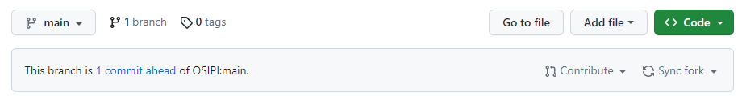

# How to create a copy of the repository and contribute changes

The instructions outlined below shows a few (but far from all) ways for creating a copy of the repository and contribute with changes.

# Creating a local copy of the repository
Create a github user: [Link to Github](https://github.com/)

Create your own fork of the repository with the fork button in the upper right corner:

Copy the link of your fork:

Continue with one of the following methods:

## Using Visual Studio Code
Press the "Clone Repository" button under the "Source Control" tab and follow the instructions:

## Using commandline tools
- `git clone <repository name>`
- e.g. `git clone git@github.com:oscarjalnefjord/TF2.4_IVIM-MRI_CodeCollection.git`

# Contributing changes
If you have made changes, e.g. added new IVIM code from you group or made some change to the existing code, it can be transfered to the OSIPI repository by a commit and pull request. 

First, upload your changes to github by a commit (see alternative methods below).

Second, generate a pull request for the OSIPI repository maintainers to accept by pressing the "Contribute" and then "Open pull request". Follow the instructions and write a message for the maintainers such that it is understandable what changes and/or additions to the code are intended to do.

## Using Visual Studio Code
Press the "Commit" button under the "Source Control" tab after writing some short description of the commit e.g. "nlls fitting GU SWE":

Push the changes to github with the "Sync Changes" button under the "Source Control" tab:

## Using commandline tools
- `git commit -am "commit message"`
- `git push`
