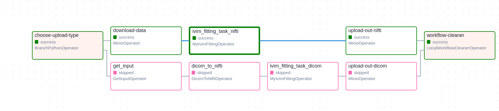
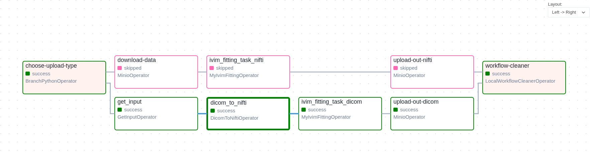

# IVIM Fitting Method Workflow for Kaapana Introduction and Installation Process

## Overview

This workflow wraps TF2.4_IVIM_code_collection (OSIPI) implementations into a reproducible, user-friendly workflow so researchers and
clinicians can apply all the Intravoxel Incoherent Motion (IVIM) fitting algorithms. The workflow supports both NIfTI and DICOM input
formats with automatic conversion capabilities.

## Getting Started

To use this IVIM fitting workflow:

1. Ensure you have Kaapana install as the workflow can only be run on Kaapana.
   You can follow this guide to [install Kaapana](INSTALL_KAAPANA.md)
2. Clone or download this repository
3. cd into TF2.4_IVIM_code_collection/kaapana_ivim_osipi
4. Follow the installation steps below
5. Deploy to your Kaapana platform
6. Execute workflows through the Kaapana UI

## Folder Structure

```
ivim-fitting-method/
├── extension/
│   ├── docker/
│   │   ├── Dockerfile
│   │   └── files/
│   │       ├── dag_ivim-fitting_method.py
│   │       └── ivim-fitting-method/
│   │           ├── DicomToNiftiOperator.py
│   │           └── MyIvimFittingOperator.py
│   └── ivim-fitting-method-workflow/
│       ├── Chart.yaml
│       ├── README.md
│       ├── requirements.yaml
│       └── values.yaml
└── processing-containers/
    ├── dicom_to_nifti/
    │   ├── Dockerfile
    │   ├── convert_dicom_to_nifti.py
    │   └── requirements.txt
    └── ivim-fitting-method/
        └── Dockerfile
```

## Component Breakdown

### 1. Processing Containers (`processing-containers/`)

Contains the actual algorithm implementations that run as Docker containers:

#### `dicom_to_nifti/`

- **Purpose**: Converts DICOM images to NIfTI format with proper metadata extraction
- **Main Script**: `convert_dicom_to_nifti.py`
- **Dependencies**: Listed in `requirements.txt`
- **Output**: NIfTI files (.nii.gz) with extracted b-values and b-vectors

#### `ivim-fitting-method/`

- **Purpose**: Executes IVIM fitting algorithms on diffusion-weighted imaging data
- **Supported Algorithms**: 18 different IVIM fitting methods including:
  - `ASD_MemorialSloanKettering_QAMPER_IVIM`
  - `ETP_SRI_LinearFitting`
  - `IAR_LU_biexp`
  - `OGC_AmsterdamUMC_Bayesian_biexp`
  - `OJ_GU_seg` (default)
  - And 13 more specialized algorithms
- **Input**: 4D NIfTI files with corresponding b-value and b-vector files
- **Output**: Parameter maps (perfusion fraction, diffusion coefficient, etc.)

### 2. Extension (`extension/`)

Contains workflow orchestration and deployment configuration:

#### `docker/`

Contains the DAG (Directed Acyclic Graph) definition and custom operators:

- **`Dockerfile`**: Containerizes the DAG code for Airflow
- **`dag_ivim-fitting_method.py`**: Main workflow definition with:
  - Input type branching (NIfTI vs DICOM)
  - User interface forms for parameter selection
  - Task dependencies and execution flow
- **`ivim-fitting-method/`**: Custom operators
  - **`DicomToNiftiOperator.py`**: Operator for DICOM conversion
  - **`MyIvimFittingOperator.py`**: Operator for IVIM algorithm execution

#### `ivim-fitting-method-workflow/`

Helm chart configuration for Kubernetes deployment:

- **`Chart.yaml`**: Chart metadata and version information
- **`values.yaml`**: Default configuration values
- **`requirements.yaml`**: Chart dependencies

## Workflow Features

### Input Flexibility

- **NIfTI Input**: Direct upload of NIfTI files with separate b-value/b-vector files
- **DICOM Input**: Automatic conversion from raw DICOM files to NIfTI format
- **Intelligent Branching**: Workflow automatically selects appropriate processing path

### User Configuration

The workflow provides extensive configuration options through the UI:

1. **Upload Type Selection**: Choose between NIfTI or DICOM input
2. **File Path Specification**: Comma-separated paths for NIfTI, b-value, and b-vector files
3. **Affine Matrix**: Optional affine transformation matrix
4. **Algorithm Selection**: Choose from 18 different IVIM fitting algorithms
5. **Additional Arguments**: Extra parameters for fine-tuning algorithm behavior

### Processing Paths

The workflow implements two distinct processing paths based on the input type selected by the user. The path selection happens at the beginning of the workflow through the `choose-upload-type` branch operator.

#### NIfTI Processing Path

When users select "nifti" as the upload type, the workflow follows this path:

1. **User Upload**: User uploads NIfTI files, b-value, and b-vector files to MinIO storage
2. **Download Data** (`download-data` task):
   - Uses `MinioOperator` to retrieve files from `uploads/Data/` bucket
   - Downloads the 4D NIfTI file, .bval, and .bvec files
   - Files are made available to subsequent tasks in the workflow directory
3. **IVIM Fitting** (`ivim_fitting_task_nifti` task):
   - Executes `MyIvimFittingOperator`
   - Processes the NIfTI data using the selected IVIM algorithm
   - Generates parameter maps (perfusion fraction, diffusion coefficient, etc.)
4. **Upload Results** (`upload-out-nifti` task):
   - Uses `MinioOperator` to upload results back to MinIO
   - Only `.nii.gz` files are uploaded (filtered by `whitelisted_file_extensions`)
   - Results stored in `uploads/` bucket for user access
5. **Cleanup** (`workflow-cleaner` task):
   - Removes temporary files from the workflow directory
   - Frees up storage space on the compute nodes



#### DICOM Processing Path

When users select "dicom" as the upload type, the workflow follows this extended path:

1. **User Upload**: User uploads DICOM files to the platform
2. **Get Input** (`get_input` task):
   - Uses `GetInputOperator` to retrieve DICOM files from user selection
   - Prepares DICOM series for processing
3. **DICOM to NIfTI** (`dicom_to_nifti` task):
   - Executes `DicomToNiftiOperator`
   - Converts DICOM series to NIfTI format
   - Extracts diffusion parameters from DICOM metadata
   - Generates .bval and .bvec files automatically
4. **IVIM Fitting** (`ivim_fitting_task_dicom` task):
   - Same as NIfTI path but processes the converted data
   - Uses the extracted diffusion parameters for fitting
5. **Upload Results** (`upload-out-dicom` task):
   - Uploads processed results to MinIO storage
   - Results accessible through the platform interface
6. **Cleanup**: Same cleanup process as NIfTI path



#### Path Selection Logic

The workflow uses a `BranchPythonOperator` called `choose-upload-type` to determine which path to execute:

```python
def choose_upload_type(**context):
    wf_form = context["dag_run"].conf.get("workflow_form", {})
    upload_type = wf_form.get("upload_type", "nifti")
    if upload_type == "dicom":
        return "get_input"  # Triggers DICOM path
    return "download-data"  # Triggers NIfTI path
```

When one path executes, the other path's tasks are automatically skipped, as shown in the workflow execution images.

## Installation Guide

### Prerequisites

- Running Kaapana platform
- Docker registry access
- Helm installed locally
- kubectl configured for your Kaapana cluster

### Step 1: Build and Push Container Images

Build the processing containers:

```bash
# Build DICOM to NIfTI converter
cd processing-containers/dicom_to_nifti
docker build -t <registry-name>/dicom-to-nifti:<kaapana-version> .
docker push <registry-name>/dicom-to-nifti:<kaapana-version>

# Build IVIM fitting container
cd ../ivim-fitting-method
docker build -t <registry-name>/ivim-fitting-method:<kaapana-version> .
docker push <registry-name>/ivim-fitting-method:<kaapana-version>

# Build DAG container
cd ../../extension/docker
docker build -t <registry-name>/ivim-fitting-dag:<kaapana-version> .
docker push <registry-name>/ivim-fitting-dag:<kaapana-version>
```

Replace:

- `<registry-name>`: Your Docker registry URL
- `<kaapana-version>`: Your Kaapana platform version

### Step 2: Update Chart Configuration

1. Edit `extension/ivim-fitting-method-workflow/Chart.yaml`:

   ```yaml
   version: <kaapana-version> # Match your Kaapana version
   ```

2. Update image references in `values.yaml` to match your registry and tags

### Step 3: Package Helm Chart

```bash
cd extension/ivim-fitting-method-workflow
helm dependency update
helm package .
```

This generates a `.tgz` file (e.g., `ivim-fitting-method-workflow-<version>.tgz`)

### Step 4: Deploy to Kaapana

1. Navigate to the **Extension** view in your Kaapana platform
2. Upload the generated `.tgz` file
3. Add "Experimental" to the Version field if this is a test deployment
4. Install the IVIM Fitting Method extension

### Step 5: Enable Workflow (if needed)

If the workflow doesn't appear in the Workflow Execution tab:

1. Go to **Project Management** view (requires admin privileges)
2. Select your project
3. Enable the IVIM Fitting Method workflow for the project

## Usage Instructions

### Running the Workflow

1. Navigate to **Workflow Execution** in Kaapana
2. Select "IVIM Fitting Method" from available workflows
3. Configure workflow parameters:
   - Choose upload type (NIfTI or DICOM)
   - Specify file paths (for NIfTI) or upload DICOM files
   - Select desired IVIM algorithm
   - Set any additional parameters
4. Execute the workflow

### Input Requirements

#### For NIfTI Input:

- NIfTI file (.nii.gz)
- B-value file (.bval)
- B-vector file (.bvec)
- Optional: Affine transformation matrix

#### For DICOM Input:

- DICOM series containing diffusion-weighted images

### Output

The workflow generates:

- IVIM parameter maps (perfusion fraction, diffusion coefficient, pseudo-diffusion coefficient)
- Quality control metrics
- Processing logs and reports

## Troubleshooting

### Common Issues

1. **Workflow not visible**: Check project permissions and ensure workflow is enabled
2. **Image pull errors**: Verify Docker registry access and image tags
3. **Processing failures**: Check input file formats and parameter validity

### Debug Steps

1. Check Airflow logs in Kaapana admin interface
2. Verify container logs for processing errors
3. Ensure input files meet format requirements
4. Validate algorithm-specific parameters

## Algorithm Information

Consult the algorithm documentation for specific parameter requirements and expected outputs.

## Development and Customization

### Adding New Algorithms

1. Update algorithm enum in `dag_ivim-fitting_method.py`
2. Rebuild and redeploy containers

### Modifying UI Forms

Edit the `ui_forms` dictionary in `dag_ivim-fitting_method.py` to add or modify user input fields.

### Extending Operators

Custom operators can be added to `extension/docker/files/ivim-fitting-method/` for additional functionality.

Custom operators can be added to `ivim-fitting-method/processing-containers` for additional functionality.
Their processing container should be added in

## Additional Resources

- [Kaapana Documentation](https://kaapana.readthedocs.io/)
- [IVIM Fitting Documentation](https://github.com/OSIPI/TF2.4_IVIM-MRI_CodeCollection)
- [Workflow Development Guide](https://kaapana.readthedocs.io/en/stable/development_guide/workflow_dev_guide.html)
