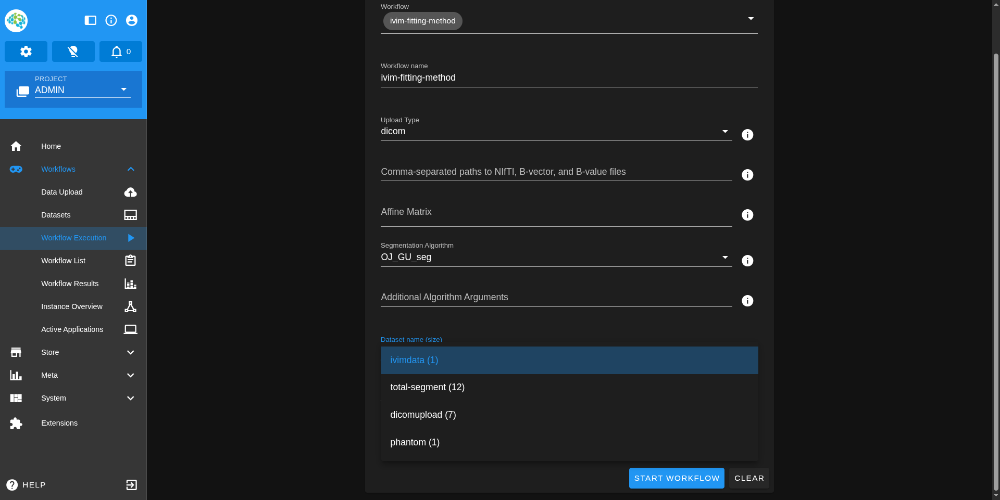

# IVIM Fitting Method Workflow User Guide

This guide explains how to use the IVIM Fitting Method Workflow after installation. For installation instructions, see [Install ivim-fitting-method workflow](README.md).

## Overview

The workflow supports two input data formats:

- **DICOM images**: The workflow converts DICOM to NIfTI and generates both formats as output
- **NIfTI files**: Requires accompanying bvec and bval files

## Using NIfTI Data

### Prerequisites

Ensure you have the following files ready:

- NIfTI file (`.nii.gz`)
- B-vector file (`.bvec`)
- B-value file (`.bval`)

### Step-by-Step Process

**Step 1: Upload Your Dataset**

1. Navigate to the Minio component in Kaapana (Store → Minio → Login with SSO)
2. Upload your NIfTI, bvec, and bval files to the `project-admin/uploads/Data/` bucket
3. Create the bucket if it doesn't exist

**Step 2: Access Workflow Execution**

1. Go to Workflows → Workflow Execution
2. Select the `ivim-fitting-method` algorithm

**Step 3: Configure and Run**

1. Select your desired algorithm
2. In the input field, specify your files as a comma-separated string
   - Example: `brain.nii.gz,brain.bvec,brain.bval`
3. Set Upload Type to "nifti"
4. Click the Run button

**Step 4: Monitor Progress**

1. Go to Workflow → Workflow List
2. Click on the logs to access Airflow
3. Use Airflow to visualize progress and view algorithm logs

**Step 5: Retrieve Results**
Access your output data from Minio at: `project-admin/uploads/ivim_fitting_task_nifti`

## Using DICOM Data

### Step-by-Step Process

**Step 1: Upload Your Dataset**

1. Use the Dataset Upload component in Kaapana
2. Upload a ZIP file containing your DICOM data
3. Assign a name to your dataset
4. Select the `import-dicoms-from-data-upload` workflow

**Step 2: Access Workflow Execution**
Navigate to Workflows → Workflow Execution and select `ivim-fitting-method` algorithm

**Step 3: Configure and Run**

1. Select your desired algorithm
2. Set Upload Type to "dicom"
3. Choose your dataset from the Dataset Name dropdown
4. Click the Run button

**Step 4: Monitor Progress**
Same as NIfTI workflow - use Workflow → Workflow List → Logs to access Airflow monitoring

**Step 5: Retrieve Results**
Access your output data from Minio at: `project-admin/uploads/ivim_fitting_task_dicom`

## Workflow Form Parameters

Understanding the key parameters in the workflow form:

| Parameter                          | Description                                                                                |
| ---------------------------------- | ------------------------------------------------------------------------------------------ |
| **Upload Type**                    | Choose between "NIfTI" (requires B-vector and B-value files) or "Raw DICOMs"               |
| **Source Files**                   | Comma-separated file paths for NIfTI, B-vector, and B-value files (NIfTI uploads only)     |
| **Dataset Name**                   | Select the DICOM dataset from the dropdown (DICOM uploads only)                            |
| **Affine Matrix**                  | Space-separated numbers for the NIfTI affine matrix Example: `1 0 0 0 0 1 0 0 0 0 1 0` |
| **Segmentation Algorithm**         | Algorithm for data processing (default: `OJ_GU_seg`)                                       |
| **Additional Algorithm Arguments** | Optional extra parameters for the algorithm                                                |

### Important Notes

- **Other parameters** like "Limit dataset size" are not required and can be ignored
- **For NIfTI datasets**: You can select any Dataset Name from the dropdown - it won't affect the processing since the workflow uses the files you specify in Source Files
- **For DICOM datasets**: You don't need to specify anything in the Source Files field - just select the appropriate Dataset Name

## Quick Reference

### NIfTI Workflow Summary

1. Upload files to Minio (`project-admin/uploads/Data/`)
2. Run workflow with comma-separated filenames
3. Retrieve results from `project-admin/uploads/ivim_fitting_task_nifti`

### DICOM Workflow Summary

1. Upload ZIP file via Dataset Upload component
2. Run workflow by selecting dataset name
3. Retrieve results from `project-admin/uploads/ivim_fitting_task_dicom`
