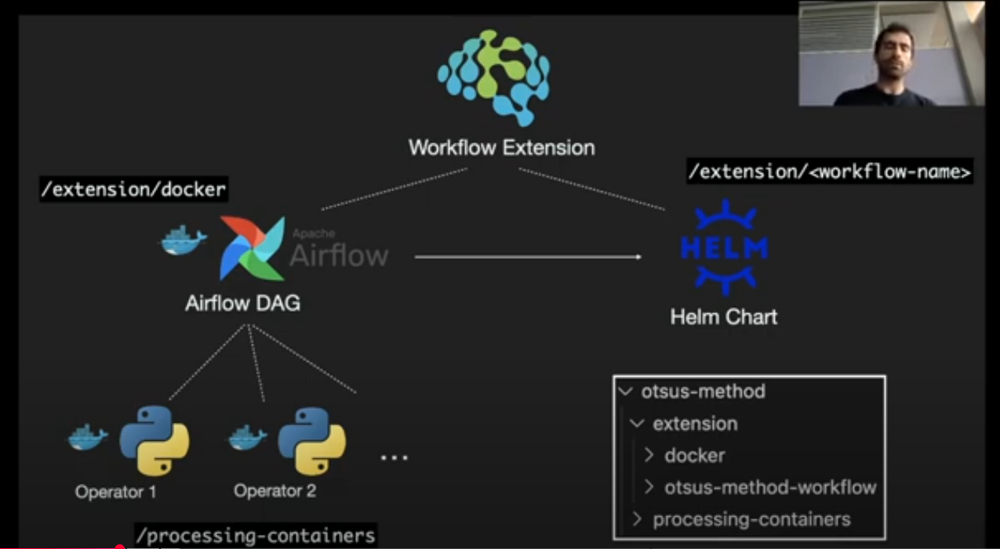

# Installing Otsus Template Method in Kaapana

## Overview

This guide documents the process of installing the Otsus template method workflow in Kaapana to understand how to add new workflows to the system. By following this installation, you'll become familiar with the workflow addition process in Kaapana.

## Getting Started

To access the Otsus workflow, clone the Kaapana repository:
```bash
git clone https://github.com/kaapana/kaapana
```

The sample Otsus workflow is located at:
```
./kaapana/templates_and_examples/examples/processing-pipelines/otsus-method
```

## Workflow Components

Before proceeding, let's understand the components of a Kaapana workflow. For detailed information, refer to the [Kaapana documentation](https://kaapana.readthedocs.io/en/stable/development_guide/workflow_dev_guide.html).

### Folder Structure

```
otsus-method
├── extension
│   ├── docker
│   │   ├── Dockerfile
│   │   └── files
│   │       ├── dag_otsus_method.py
│   │       └── otsus-method
│   │           ├── OtsusMethodOperator.py
│   │           └── OtsusNotebookOperator.py
│   └── otsus-method-workflow
│       ├── Chart.yaml
│       ├── README.md
│       ├── requirements.yaml
│       └── values.yaml
└── processing-containers
    └── otsus-method
        ├── Dockerfile
        └── files
            ├── otsus_method.py
            ├── otsus_notebooks
            │   ├── run_otsus_report_notebook.ipynb
            │   └── run_otsus_report_notebook.sh
            └── requirements.txt
```

### Processing Containers

The `processing-containers` folder contains:
- **Algorithm implementations**: All the algorithms you want to run
- **Dockerfile**: For containerizing the algorithm
- **otsus_method.py**: The main Otsus algorithm
- **otsus_notebooks**: Report analysis components including graphs

### Extension Folder

The extension folder contains configuration and files needed for the DAG, divided into two main parts:

#### 1. otsus-method-workflow
Contains everything related to Helm chart configuration used to deploy the workflow.

#### 2. docker
Contains all the code for specifying the DAG workflow:

- **Dockerfile**: DAG codes need to be containerized
- **otsus-method folder**: Contains all operators (nodes) for the DAG
  - **OtsusMethodOperator.py**: Operator for the Otsus algorithm using the Docker image from processing-containers
  - **OtsusNotebookOperator.py**: Operator for the Notebook using the image from processing-containers
  - **Built-in operators**: Such as "DcmConverterOperator" for converting DICOM images to NIfTI
- **dag_otsus_method.py**: Configures the DAG using the operators

> **Note**: Each operator is essentially a Docker container uploaded to your registry. The processing-containers images will be pulled from the registry.

### Workflow Architecture

Below is a visual representation of a workflow in Kaapana:



## Installation Steps

Follow these four steps to install the workflow:

### Step 1: Build Container Images

Build the container image using:
```bash
docker build -t <registry-name>/<image-name>:<version>
```

Where:
- `registry-name`: Name of your registry
- `image-name`: Name of the image (found in Dockerfile)
- `version`: Version number of Kaapana

Repeat this process for both images in the files.

After building, push the image to your registry:
```bash
docker push <registry-name>/<image-name>:<version>
```

### Step 2: Package Helm Chart

1. Update the `Chart.yaml` version to match your Kaapana version

2. Inside the `otsus-method-workflow` folder, run:
   ```bash
   helm dep up
   ```
   This installs all requirements.

3. Package the chart:
   ```bash
   helm package .
   ```
   This command generates a `.tgz` file.

### Step 3: Upload to Kaapana Platform

1. Navigate to the Extension view in your Kaapana platform
2. Upload the `.tgz` file
3. Add "Experimental" to the Version field
4. You'll see the Otsus method added as part of the workflow
5. Install the Otsus method extension

### Step 4: Run and Test the Workflow

If the Otsus method doesn't appear in the Workflow Execution tab, follow the guidance from the [Kaapana FAQ](https://kaapana.readthedocs.io/en/stable/faq/workflow_not_listed.html#workflow-not-allowed-in-the-selected-project):

> "If you cannot find a workflow in the list of executable workflows in the Workflow Execution view, it might be that the workflow is not allowed in the selected project. A platform administrator can enable the workflow for the project in the Project Management view."

## Conclusion

Following these steps will successfully install the Otsus template method workflow in Kaapana. This process provides a solid foundation for understanding how to add custom workflows to the Kaapana system.

## Additional Resources

- [Kaapana Documentation](https://kaapana.readthedocs.io/en/stable/development_guide/workflow_dev_guide.html)
- [Workflow FAQ](https://kaapana.readthedocs.io/en/stable/faq/workflow_not_listed.html#workflow-not-allowed-in-the-selected-project)
- [Kaapana GitHub Repository](https://github.com/kaapana/kaapana)
